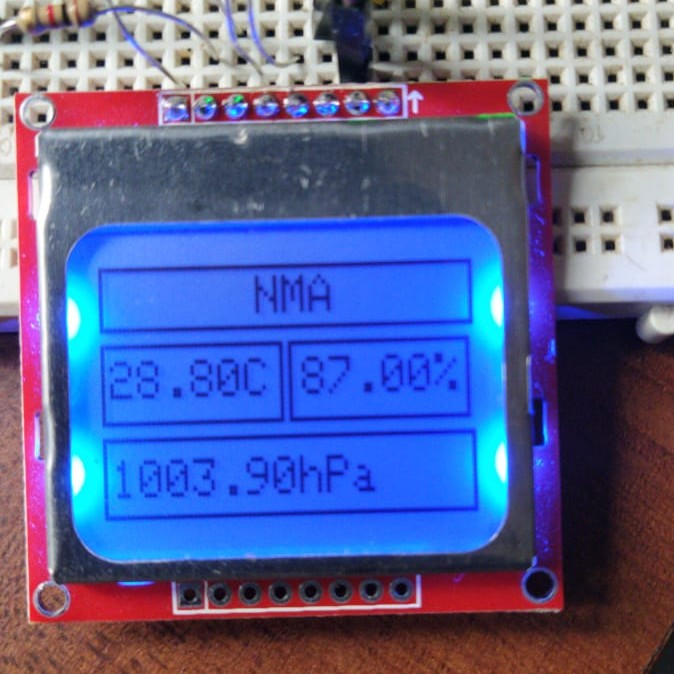
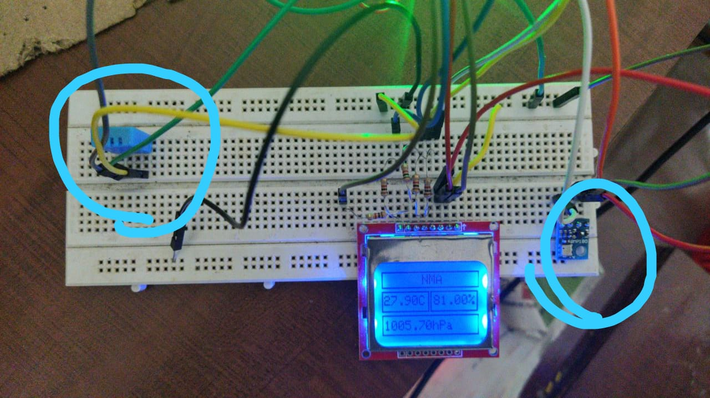
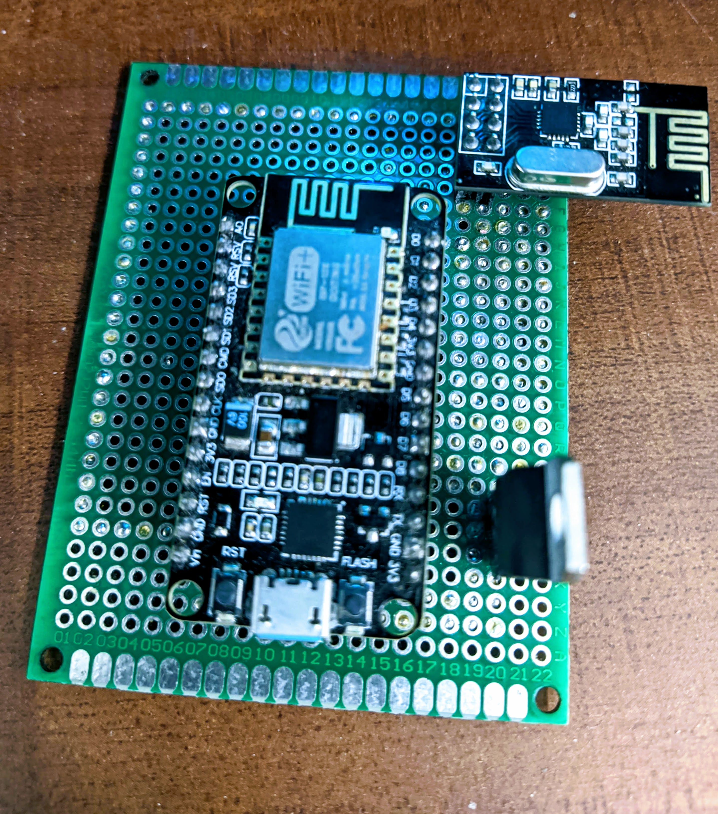

# automation1.0
## NRF24l01

The multi-receiver capacity of nRF24L01 is having up to 6 channels (pipes) of radio communication open in a receiving or read mode simultaneously. This takes the form of a hub receiver (PRX - primary receiver) and up to six transmitter nodes (PTX1 - PTX6 primary transmitters). In the above diagram, six reading (Data) pipes are opened in the primary receiver hub (PRX). Each PTX node links to one of these pipes to use both in transmitting and receiving (TX toward the hub being the primary direction of data flow, but the PTX nodes are RX capable as well).

## 20/12/2020
-----------

## 25/12/2020

1. Using LORA RFM69H module instead of the NRF24l01
   - NRF24l01 practical range is limited to 100 meters 
   - RFM69H has a range of 500 meter without directional antenna 

2. Outdoor unit will equipped with RFM while all indoor units are with nrf24l01
3. thinking about using raspberry pi zero instead of nodeMCU as a gateway
   - Server setup can be done on raspberry pi
   - more RAM and flash (memory card)
   - additional features
   - The network can be expanded in the future

## 14/03/21

